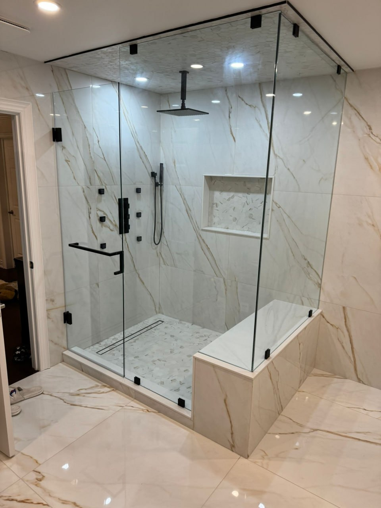

# 📸 How to Add Real Project Photos to Instagram Section

## Current Status
The Instagram section is live with **placeholder images from Unsplash**. All links point to: https://www.instagram.com/snf_improvements_inc/

---

## Option 1: Send Me Photos (Easiest)

### What I Need:
**6 project photos** (JPG or PNG format)

**Best Photos to Use:**
- Before & After shots
- Finished basements
- Bathroom renovations
- Kitchen remodels
- Flooring installations
- Staircase work
- Any impressive completed projects

**Photo Specs:**
- **Size:** At least 800x800px (bigger is better)
- **Format:** JPG or PNG
- **Aspect Ratio:** Square (1:1) works best, but I can crop any photo
- **Quality:** High resolution, good lighting

### How to Send:
1. Send me the 6 photos in Telegram
2. I'll upload them and update the site
3. Takes me ~5 minutes
4. Deploy and done!

---

## Option 2: Upload Photos to Vercel (If You Want to Do It)

### Step 1: Prepare Your Photos
1. Name them clearly:
   - `project-1.jpg`
   - `project-2.jpg`
   - `project-3.jpg`
   - etc.

2. Optimize them (optional but recommended):
   - Use https://tinypng.com/ to compress
   - Keeps quality, reduces file size

### Step 2: Upload to Project
```bash
# Create images folder
cd /root/.openclaw/workspace/snf-improvements-v2
mkdir -p images

# Copy your photos to the images folder
# (You'd upload them via SFTP or drag-drop in VS Code)
```

### Step 3: Update index.html
Find this section (around line 700):
```html
<div class="instagram-post">
    <a href="https://www.instagram.com/snf_improvements_inc/" target="_blank">
        
        <div class="instagram-overlay">
            <span>👁️ View on Instagram</span>
        </div>
    </a>
</div>
```

Change the `src=` to your image:
```html

```

Do this for all 6 posts, using different photos.

### Step 4: Deploy
```bash
git add .
git commit -m "Added real project photos"
git push origin master
```

Vercel auto-deploys in 30 seconds!

---

## Option 3: Use Instagram Widget (Auto-Updates from Instagram)

If you want the feed to **automatically update** when new photos are posted to Instagram:

### Free Services:
1. **EmbedSocial** (embedsocial.com) - Free plan available
2. **SnapWidget** (snapwidget.com) - Simple, free
3. **Elfsight** (elfsight.com) - 7-day free trial

### How It Works:
1. Sign up for one of the services
2. Connect Instagram account (@snf_improvements_inc)
3. Customize widget appearance (colors, layout, etc.)
4. Copy the embed code they give you
5. Send me the code
6. I'll add it to the site
7. Feed automatically updates when client posts to Instagram!

### Pros:
- Automatic updates (no manual work)
- Shows latest Instagram content
- Looks professional

### Cons:
- Requires signing up for a service
- Free plans usually have branding ("Powered by...")
- Paid plans remove branding (~$10-20/month)

---

## Which Option Should You Choose?

### Choose Option 1 (Send Me Photos) if:
- ✅ You want it done fast
- ✅ You just want 6 good photos on the site
- ✅ You don't need auto-updates from Instagram

### Choose Option 2 (Upload Yourself) if:
- ✅ You want to learn how to update it yourself
- ✅ You have FTP/file access
- ✅ You might update photos regularly

### Choose Option 3 (Instagram Widget) if:
- ✅ Client posts to Instagram regularly
- ✅ You want the site to auto-update
- ✅ You're okay signing up for a service
- ✅ Budget allows for paid widget ($10-20/mo) if needed

---

## My Recommendation: Option 1

**Just send me 6 photos** and I'll have it done in 5 minutes. Clean, fast, looks great. 

The Instagram section already:
- ✅ Links to their profile
- ✅ Shows "Follow us on Instagram" CTA button
- ✅ Has hover effects
- ✅ Is mobile responsive
- ✅ Loads fast

We just need to swap the placeholder images with real project photos!

---

## Photo Selection Tips

**What makes a good portfolio photo:**
- ✅ Well-lit (natural light is best)
- ✅ Shows finished work (not mid-construction)
- ✅ Clean, tidy space
- ✅ Shows craftsmanship details
- ✅ Makes people say "Wow, I want that!"

**Variety is good:**
- 1-2 bathroom renovations
- 1-2 basement projects
- 1 flooring shot
- 1 staircase or carpentry work

**Avoid:**
- ❌ Blurry photos
- ❌ Dark/poorly lit shots
- ❌ Messy work sites
- ❌ Photos with people (privacy issues)

---

## Ready?

**To add photos NOW:**
Send me 6 photos in Telegram and say "add these to SNF site"

**Questions?**
Just ask! I can:
- Crop photos to square
- Adjust brightness/contrast
- Resize for web
- Whatever you need!

---

**Current Live Site:** https://snf-improvements-v2.vercel.app/
(Scroll down to see the Instagram section with placeholder photos)
